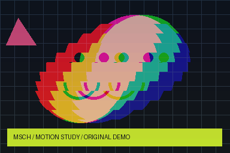

# MSCH TimeSlice

Temporal displacement of video bands and cubes with time-offset color ramps, RGB spread and jitter.

[Node reference](docs/NODES.md) · [Example workflows and results](examples/README.md) · [Publishing guide](PUBLISHING.md)



[Play / download the rendered demo](examples/results/demo.mp4)

## Included nodes

| Node | What it does |
|---|---|
| [TimeSlice ▸ Temporal Displacement](docs/NODES.md#timeslice) | Sample different input-frame times at different spatial positions. |

## Installation

Clone into `ComfyUI/custom_nodes`:

```bash
git clone https://github.com/mariobilly/msch-timeslice.git
```

Open a terminal in the cloned folder and install requirements using **the same Python environment as ComfyUI**:

```bash
python -m pip install -r requirements.txt
```

Windows portable, from `ComfyUI_windows_portable`:

```powershell
.\python_embeded\python.exe -m pip install -r .\ComfyUI\custom_nodes\msch-timeslice\requirements.txt
```

Restart ComfyUI and refresh the browser. Load a JSON workflow from `examples/` and select the supplied demo input or your own media. Keep only one installed copy of each package to avoid duplicate node registrations.

## Requirements and behavior

Requires a multi-frame IMAGE batch for a visible time-displacement effect. A single frame or span_frames=0 passes through unchanged. Band size sets the spatial slices; span_frames sets the temporal spread. Audio and playback FPS stay with the external video loading/encoding nodes.

## Documentation and examples

[docs/NODES.md](docs/NODES.md) documents every input, default, range, choice and output. [examples/README.md](examples/README.md) explains which inputs and other nodes each workflow needs and how the included results were produced.

## ComfyUI Manager

The release includes Comfy Registry metadata and a GitHub publishing action. **Registry publication is pending publisher setup**. A separate ComfyUI Manager node-list registration is being submitted; listing is pending maintainer acceptance. Git installation works independently. See [PUBLISHING.md](PUBLISHING.md).

## Validation

Imports and input schemas were checked against the local ComfyUI environment with Python 3.12.10, PyTorch 2.10 and CUDA available. Example render coverage is documented per workflow; this is not a claim of compatibility testing on every platform or of full MiniMax H3 model-generation validation.

## License

Project code: [MIT](LICENSE). Third-party assets and optional model weights keep their own licenses.
