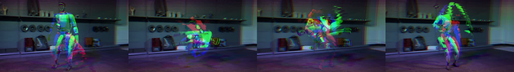
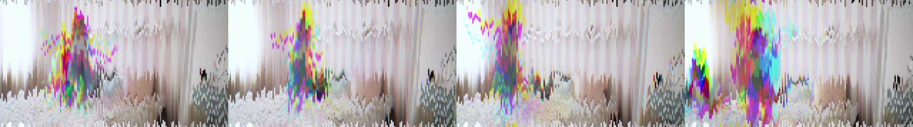
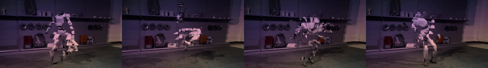

# MSCH TimeSlice showcase

Examples supplied by Mario from the MSCH Node Showcase collection. The output files are preserved as supplied.

Each band (or cube) of the frame samples a different moment of the clip, so motion melts and echoes through time. Extras: pixelate/jitter datamosh, per-channel chroma spread, 2-D time cubes, colour-ramp tinting.

- robot_vertical_chroma_rainbow.mp4 - vertical bands, span 28 frames, ease curve, mirror edges, chroma_spread 8, rainbow tint
- robot_time_cubes_thermal.mp4 - cubic_px 48 time-cubes with lateral flow, thermal tint
- kids_datamosh_jitter.mp4 - horizontal bands anchored top, pixelate 6 px + jitter 30 px (tearing datamosh)

## Gallery

Click a video preview to open its file on GitHub, or use the download link.

### Kids datamosh jitter

[Open MP4](outputs/kids_datamosh_jitter_00001.mp4) · [Download original](https://github.com/mariobilly/msch-timeslice/raw/refs/heads/main/examples/showcase/outputs/kids_datamosh_jitter_00001.mp4)

### Robot time cubes thermal

[Open MP4](outputs/robot_time_cubes_thermal_00001.mp4) · [Download original](https://github.com/mariobilly/msch-timeslice/raw/refs/heads/main/examples/showcase/outputs/robot_time_cubes_thermal_00001.mp4)

### Robot vertical chroma rainbow

[Open MP4](outputs/robot_vertical_chroma_rainbow_00001.mp4) · [Download original](https://github.com/mariobilly/msch-timeslice/raw/refs/heads/main/examples/showcase/outputs/robot_vertical_chroma_rainbow_00001.mp4)

## API workflows

These JSON files are ComfyUI API prompts, not canvas-format workflows. Send one as the `prompt` field of a `/prompt` request, or use a tool that accepts API workflows. A canvas importer may require conversion.

Choose your own source media and installed models before running. Source photos, video clips, audio and model weights are not bundled in this showcase. The supplied render settings and connections are retained; machine-specific absolute paths in the API copies use `INPUT_ROOT/` or `LOCAL_FILES/` placeholders. Replace these with paths valid on your computer.

- [timeslice_api.json](workflows_api/timeslice_api.json): `TimeSlice`, `VHS_LoadVideo`, `VHS_VideoCombine`.

### Input files and models

| Workflow | Node | Input | Source selection |
|---|---|---|---|
| `timeslice_api.json` | `1` | `video` | `msch_robot.mp4` |
| `timeslice_api.json` | `6` | `video` | `msch_kids.mp4` |

Install ComfyUI-VideoHelperSuite for the `VHS_*` loader/combine nodes.

## Source notes

The collection notes identify images from the Jim Morrison image library, Mario’s clips, and the Suno track “Crushing Syncopation”. Those source assets are not included separately. The rendered media is supplied as showcase material; the repository’s MIT license describes the node code and does not establish a separate license for underlying media.
